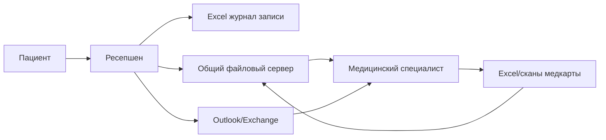
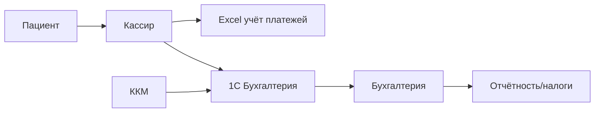
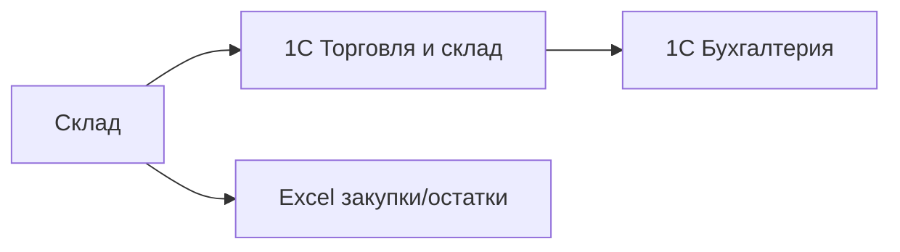
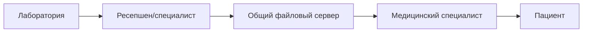
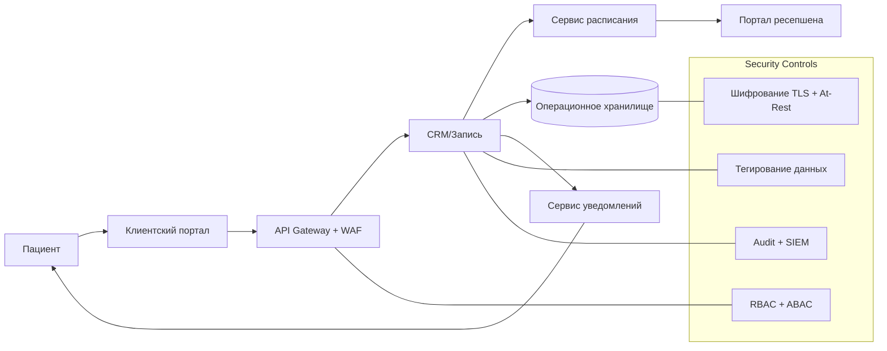
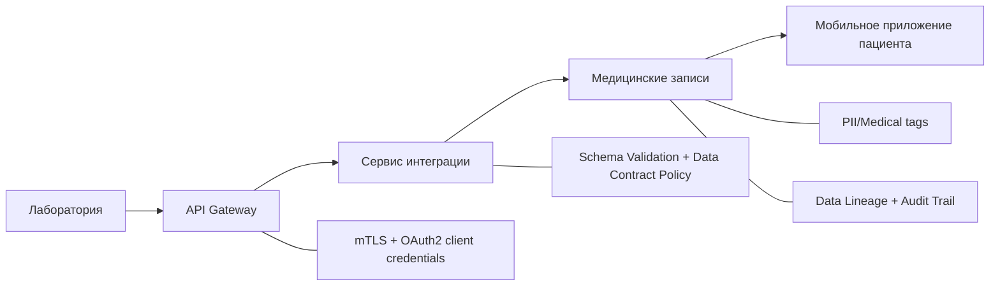
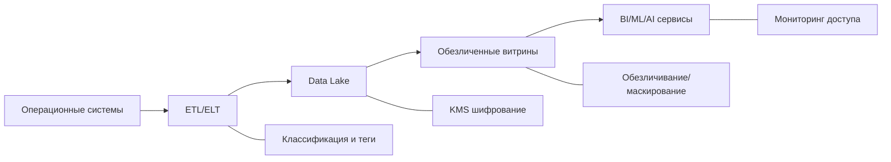

# Task1 — Анализ безопасности системы

## 1. Инвентаризация конфиденциальных данных

### 1.1 Категории данных в компании

- Идентификационные данные: ФИО, дата рождения, пол, номер договора.
- Контактные данные: телефон, email, адрес.
- Паспортные и регистрационные данные (в расширенных формах).
- Медицинские данные: жалобы, диагнозы, назначения, анализы, заключения, история обращений.
- Платёжные данные: сумма, услуги, чек, способ оплаты, возвраты.
- Кадровые и зарплатные данные сотрудников.
- Операционные данные: журналы записи, изменения в расписании, служебные комментарии.

### 1.2 Неучтённые или слабо учтённые данные As-Is

- Сканы договоров и меддокументов (`JPG/PDF`) без единой классификации.
- Файлы Excel с копиями персональных и медицинских данных.
- Переписка в почте (Outlook/Exchange), содержащая ПДн и медицинскую тайну.
- Метаданные действий пользователей: кто открыл, изменил, отправил файл.
- Технические логи интеграций с 1С/ККМ, потенциально содержащие PII.
- Экспорт/копии файлов на общих сетевых папках без контроля жизненного цикла.

### 1.3 Критичные классы данных для защиты

- `STRICT_MED`: медицинская тайна (диагнозы, анализы, заключения).
- `STRICT_PII`: специальные и биографические ПДн (ФИО, дата рождения, адрес, паспортные данные).
- `FINANCE_PII`: платёжные записи, чеки, реквизиты контрагентов.
- `HR_CONF`: кадровые/зарплатные данные сотрудников.
- `INTERNAL`: служебные данные без прямой персонализации.

## 2. Диаграммы потоков данных As-Is

Ниже представлены отдельные DFD по ключевым процессам в текущем состоянии.

### 2.1 Процесс записи пациента и приёма

Операции: ввод, чтение, копирование, отправка по почте, хранение файлов.

### 2.2 Процесс оплаты и бухгалтерии

Операции: двойной ввод, сверка, выгрузка отчётов.

### 2.3 Процесс учёта ТМЦ

Операции: ввод, синхронизация между 1С, локальные выгрузки.

### 2.4 Процесс лабораторных данных (текущий ручной контур)

Операции: ручной импорт результатов, хранение в файлах, уведомление пациента.

## 3. Аудит мер безопасности и проблемные зоны

### 3.1 Аудит текущего состояния

| Область | Текущее состояние | Риск |
|---|---|---|
| Классификация данных | Отсутствует единая модель классификации | Неверный уровень защиты |
| Доступ к данным | Доменная аутентификация без детального разграничения | Избыточный доступ сотрудников |
| Хранение | Excel/JPG/PDF на общем диске | Утечки через копирование и пересылку |
| Передача данных | Потоки не формализованы и не контролируются | Неконтролируемое распространение ПДн |
| Аудит действий | Нет сквозного аудита чтения/изменения | Невозможно расследовать инциденты |
| Жизненный цикл данных | Нет правил удаления и минимизации | Нарушение принципа Data Minimization |
| Интеграции | API-политики отсутствуют (фактически ручной обмен) | Ошибки авторизации и раскрытие данных |
| Мониторинг ИБ | Нет поведенческой аналитики и алертов по аномалиям | Позднее выявление инцидентов |

### 3.2 Список проблемных зон

1. Конфиденциальные данные распределены по неуправляемым хранилищам.
2. Отсутствует модель ролей/атрибутов доступа для медицинских данных.
3. Нет разделения пациентских доменов: риск доступа к данным другого пациента.
4. Нет стандарта безопасной разработки и проверок релизов на утечки данных.
5. Не реализован Data Lineage: невозможно проследить происхождение и маршрут данных.
6. Ручные процессы повышают вероятность ошибок и несанкционированных действий.
7. Не внедрены механизмы «право на удаление/ограничение обработки» по запросу субъекта.

### 3.3 Что улучшить в первую очередь

- Ввести единую классификацию и обязательное тегирование данных.
- Реализовать RBAC+ABAC для всех новых сервисов и критичных текущих процессов.
- Вынести критичные данные из Excel/сканов в централизованные защищённые сервисы.
- Добавить сквозной аудит доступа и событийную аналитику аномалий.
- Встроить Privacy by Design в процесс разработки (политики, тесты, релизные гейты).

## 4. Меры защиты, тегирование и To-Be потоки

### 4.1 Список данных и способы защиты

| Категория | Примеры | Защита |
|---|---|---|
| `STRICT_MED` | диагнозы, анализы, заключения | Шифрование at-rest/in-transit, токенизация идентификаторов, строгий ABAC |
| `STRICT_PII` | ФИО, дата рождения, паспорт, адрес | Шифрование, маскирование в UI/логах, минимизация полей в API |
| `FINANCE_PII` | чеки, платежи, реквизиты | Шифрование, контроль целостности, ограничение экспорта |
| `HR_CONF` | зарплата, кадры, налоги | Шифрование, сегментация доступа по роли и юр. основанию |
| `ANON_ANALYTICS` | обезличенные витрины BI/ML | Обезличивание/псевдонимизация, запрет реидентификации |

### 4.2 Механизм тегирования данных

#### Формат тегов

- `data.class`: `STRICT_MED | STRICT_PII | FINANCE_PII | HR_CONF | INTERNAL | ANON_ANALYTICS`
- `subject.type`: `patient | employee | contractor`
- `retention`: `1y | 3y | 5y | legal_hold`
- `geo.scope`: `ru-only`
- `lawful.basis`: `contract | consent | legal_obligation`
- `access.scope`: `self | department | cross-functional-approved`

#### Правила применения

1. Теги назначаются на уровне схемы, таблицы, поля и API-контракта.
2. Политики доступа читают теги и автоматически применяют RBAC/ABAC.
3. Релиз блокируется, если новые поля не имеют тегов или нарушают policy-as-code.
4. Логи доступа и операции обработки наследуют теги для Data Lineage.

#### Инструменты (классы решений)

- Data Catalog и классификация данных.
- DLP и контроль каналов утечки.
- KMS/Vault для управления ключами шифрования.
- API Gateway + OPA (policy-as-code) для авторизации по атрибутам.
- SIEM/UEBA для аудита и аномалий.
- CI/CD security gates (SAST/DAST/secret scanning/schema checks).

### 4.3 DFD To-Be — запись пациента через портал (MVP)

### 4.4 DFD To-Be — интеграция лаборатории по API

### 4.5 DFD To-Be — контур аналитики BI/ML/AI

## 5. Сопоставление процессов с требованиями и практиками

### 5.1 Процессы и требования безопасности

| Процесс | Ключевые требования | Практики |
|---|---|---|
| Запись на приём (портал/ресепшен) | Ограничение доступа к данным пациента, контроль операций | Privacy by Design, RBAC/ABAC, audit trail |
| Медкарта и результаты анализов | Конфиденциальность медтайны, целостность | Шифрование, минимизация атрибутов, data lineage |
| Оплата и бухгалтерия | Защита ПДн и финансовых данных, трассируемость | Сегментация, контроль экспорта, журналирование |
| Интеграция с лабораторией | Безопасные API-контракты и авторизация партнёров | API gateway, mTLS/OAuth2, contract policy checks |
| BI/ML/AI | Недопущение утечки исходных ПДн | Обезличивание, отдельные витрины, контроль доступа |

### 5.2 Проверка соответствия целям бизнеса

- Конфиденциальность: обеспечивается классификацией, тегами, шифрованием и доступом по политике.
- Масштабируемость: централизация данных и API-подход упрощают открытие филиалов.
- Сопровождаемость: policy-as-code и автоматические проверки снижают ручной контроль.
- Конфигурируемость: правила доступа и хранения меняются через конфигурацию политик.

### 5.3 Приоритетный план внедрения (коротко)

1. Ввести модель классификации и теги данных.
2. Реализовать RBAC/ABAC для MVP-процесса записи.
3. Запустить аудит доступа и централизованный сбор логов.
4. Внедрить безопасный API-контур интеграции лаборатории.
5. Построить обезличенный аналитический контур для BI/ML/AI.

## Краткий вывод

Текущий контур не обеспечивает требуемый уровень защиты ПДн и медицинской тайны: отсутствуют сегментация доступа к данным, контроль потоков, аудит действий и жизненный цикл обработки данных. Для перехода к масштабируемой модели требуется централизованная платформа данных с классификацией, тегированием, политиками доступа и встроенным контролем безопасности на всех этапах потока.
